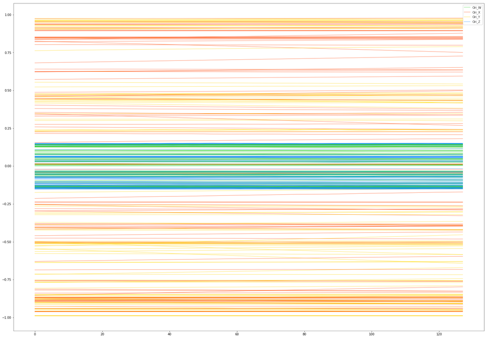

# My Approach to Solve Kaggle's "CareerCon 2019 - Help Navigate Robots" Competition

In this document, I will explain my solution to the "CareerCon 2019 - Help Navigate Robots" competition. The metric used in that competition was Multiclass Accuracy, which is simply the average number of observations with the correct label. My final score was 0.6802; the best score was 1.0; the worst score was 0. I ranked 65th among 1478 competitors.

I had many solutions to the competition differing in complexity, but this one is the one with the highest score among the ones that I submitted.

The goal of the competition was to recognize the floor surface the robots are standing on using data collected from Inertial Measurement Units (IMU sensors). The competition time-series data consists of 128 readings from each of ten sensors for around 7500 cases (3810 for training and the rest for testing). For each case, we need to determine the type of surface (concrete, carpet, tiled, etc.). So the competition's problem is a multiclass classification problem.

# 1. Exploratory Data Analysis (EDA)
I applied EDA to understand the data and the behavior of its variables, to see how the behavior of variables varies based on the surface, etc. For example, here is a plot depicting the orientation 4 variables for 100 cases:

# 2. Feature Engineering and Modeling
The solution is simple. It uses [**tsfresh**](https://github.com/blue-yonder/tsfresh) to extract and select features from our time-series data. tsfresh calculates a [lot of features](https://tsfresh.readthedocs.io/en/latest/text/list_of_features.html) with many parameters including the minimum value of the signal, the maximum, standard deviation, approximate entropy, skewness, number of peaks, etc. After that, [LightGBM](https://github.com/Microsoft/LightGBM) is used to build the model and generate predictions. The generated predictions are the probabilities of each type of surfaces for each test case. The surface with the highest probability was chosen.

The code used is available in [this Github repository](https://github.com/ammar1y/My-Solution-to-Help-Navigate-Robots-Competition) in `eda.ipynb` and `kernel.ipynb` files.

